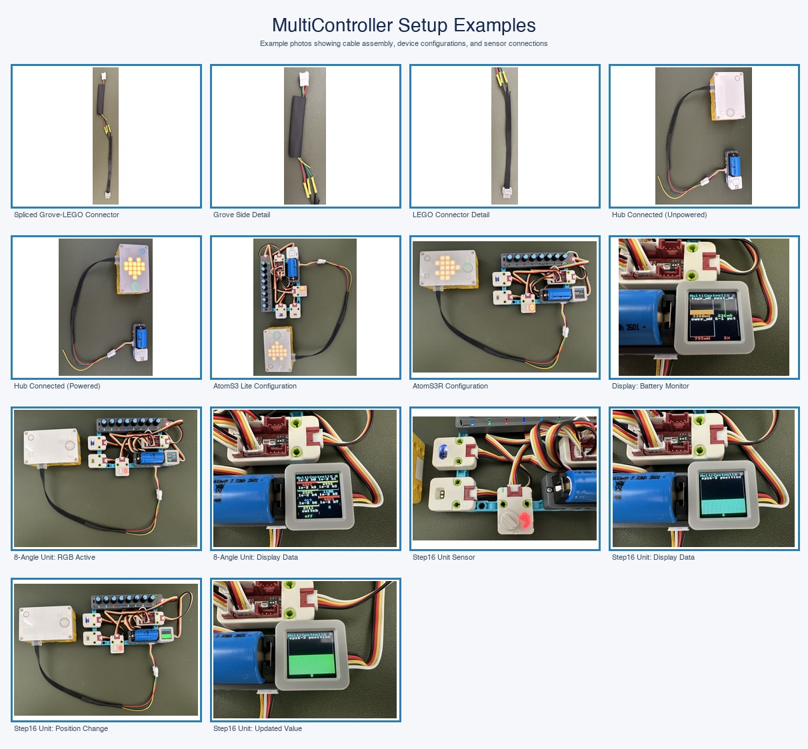
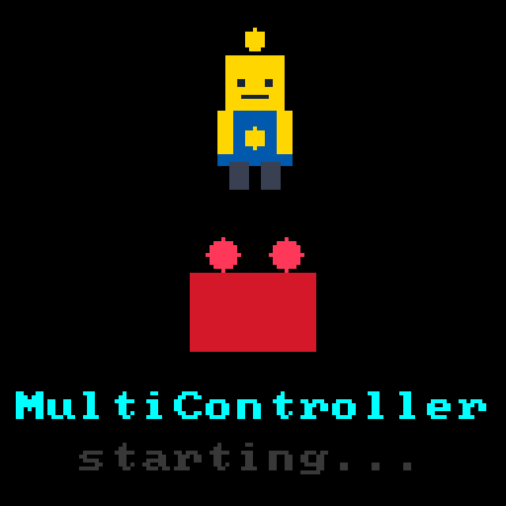
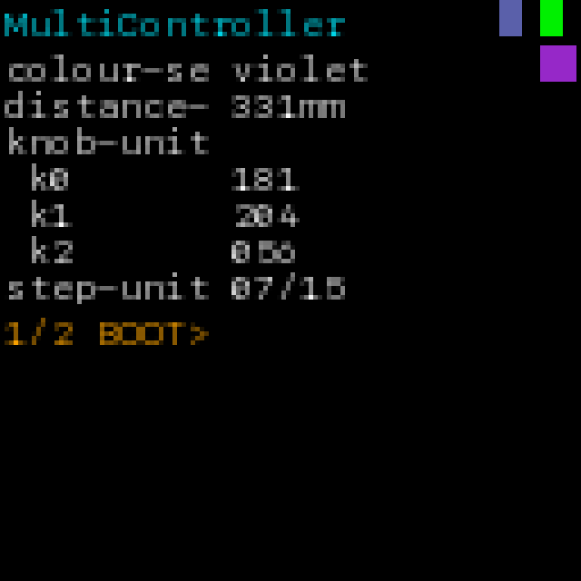
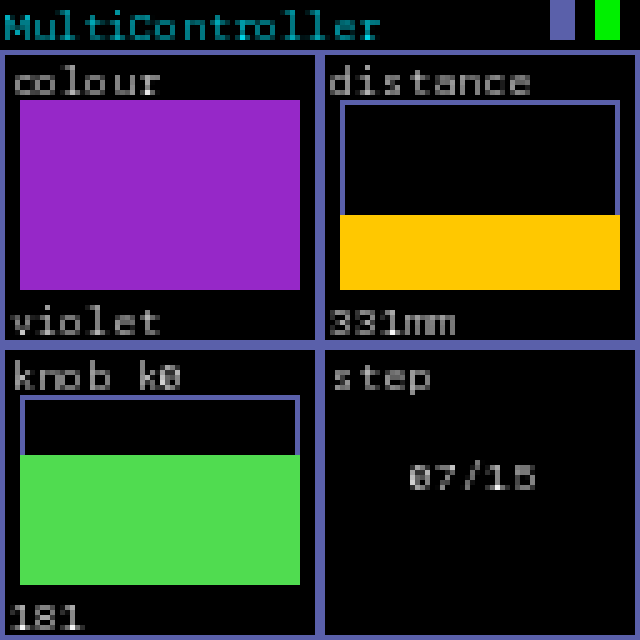
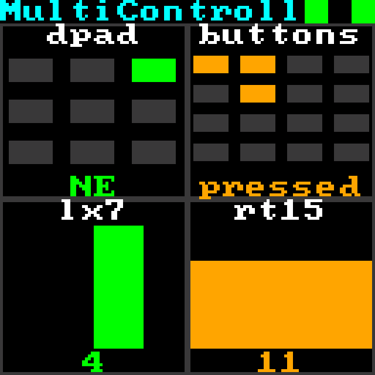
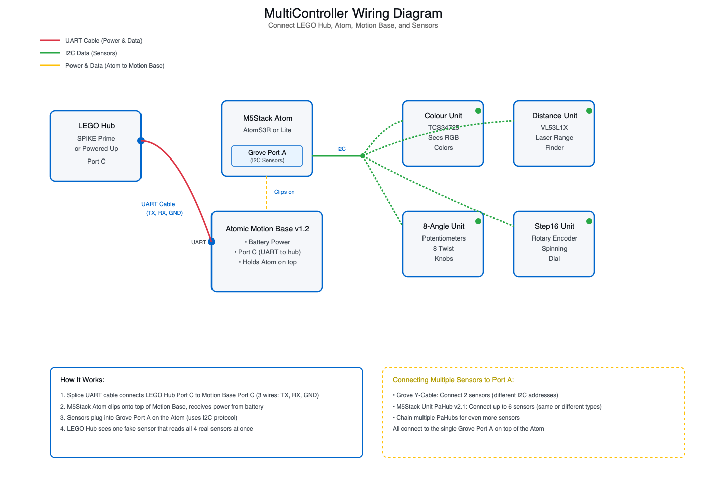
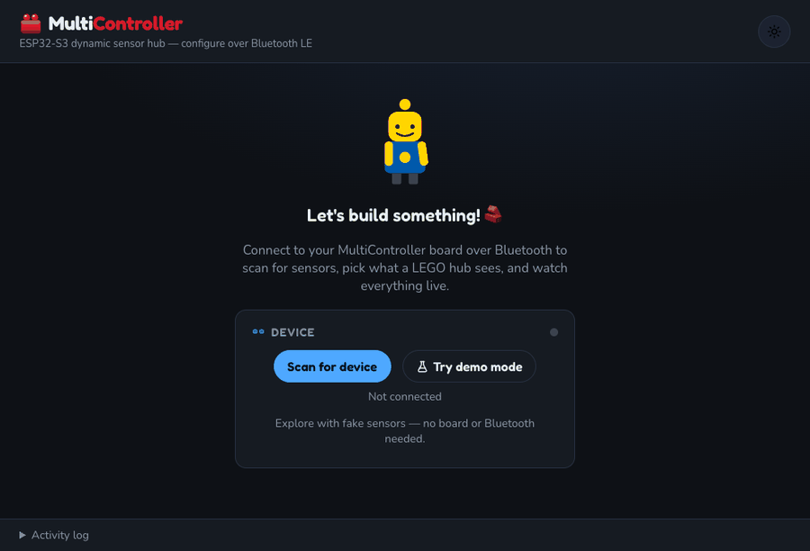

# MultiController — Keeping Retiring LEGO Education Sets Alive With M5Stack Sensors

## Cover brief description

Give retiring LEGO Education sets new sensors instead of a landfill trip: an
M5Stack AtomS3R or AtomS3 Lite + Atomic Motion Base reads Unit sensors 
(Colour, Time-of-Flight Distance, 8-Angle, Step16) and feeds a SPIKE hub over 
LPF2 — real sensor data straight into block coding or Python, no reflash to change 
what's plugged in.

---

## Cover media


The GIF above shows both the hardware (sensors in action, device variants, cable assembly) 
and the web app interface working together. For detailed examples of the hardware setup,
see the photos below showing cable preparation, device configurations, and sensor connections.

Don't have the hardware in front of you yet? The web app has a built-in **demo mode**
that lets you explore everything with fake sensor data — no board, no Bluetooth pairing required. 
You can scan virtual sensors, configure them, and watch live data on the dashboard before you ever 
pick up a soldering iron. See the full demo walkthrough further down on this page.



This montage shows example photos of building your MultiController: cable preparation, 
LEGO hub connections, different device variants (AtomS3 Lite and AtomS3R), sensor 
configurations, and the display in action.

### Mockups of the AtomS3R's onboard display

The images below are **mockups** showing what appears on the AtomS3R's built-in
screen in different modes. These represent the actual interface you'll see on
the device as it reads sensors, connects via Bluetooth, and displays live data.

**Boot splash** — when you power on the device, you see the "Brix" mascot and brick logo
briefly, followed by the device name and "starting..." message. This splash screen appears
for about a second while the device initializes.



**Connected sensor list** — device name + BLE/HID status swatches in the header,
one line per sensor (colour name + swatch, distance in mm, three 8Angle knob values,
Step16 position), with a "1/2 BOOT>" page indicator at the bottom since more
sensors are configured than fit on one screen.



**Tile/visual mode** — the same data as a 2×2 grid of bordered tiles instead of
a text list — a solid colour swatch tile, a heat-gradient distance bar, a
hue-gradient angle bar, and a plain-number step tile.



**Tile mode with gamepad input** — when a gamepad is connected via Bluetooth (shown by green
status indicators), the screen shows the gamepad's input: a grid showing which d-pad direction
is active, another grid showing which buttons are pressed, and bars showing the position of
the analog sticks and triggers.



---

## Story

Most robot sensor projects force you into a choice early on: *which* sensors
do you want? Change your mind later, and you have to reprogram the whole
device. MultiController breaks that rule: **plug in whatever sensor you want,
whenever you want, and configure it from your desktop or laptop — no
reprogramming needed**.

This project runs on **M5Stack's AtomS3 family** (choose from:
**AtomS3R** with a built-in screen, or **AtomS3 Lite** for a compact option). 
Both are tiny ESP32-S3 computers that talk wirelessly to your desktop or laptop 
and decide which sensors to read — all without touching code.

The AtomS3 alone is pretty small, so we pair it with **M5Stack's Atomic
Motion Base** — think of it as a "backpack" for the tiny computer. This
backpack gives you:
- A place to plug in sensor modules
- An extra connector where you can add motors and controllers
- A battery that keeps everything running without USB cables
- A power monitor that tells you when the battery is getting low

This is where the magic happens: when your LEGO hub plugs into Port C, it
thinks it's talking to a real LEGO colour sensor, but it's actually getting
data from whatever M5Stack sensor you plugged in. **Change the sensor, change
the code on the SPIKE hub (or run a different program), and everything just
works.**

The sensors this project supports are all from M5Stack's **Unit** product line:
- **M5Stack Colour Unit** (TCS34725 sensor) — sees red, green, blue, and brightness
- **M5Stack Time-of-Flight Distance Unit** (VL53L1X sensor) — tells you how far away objects are with lasers
- **M5Stack 8-Angle Unit** — eight potentiometer knobs you can twist, each with its own coloured RGB light
- **M5Stack Step16 Unit** (16-bit rotary encoder) — a spinning dial with 16 click-stops and a light-up ring

Plug in any mix of these, and they all work together over one cable to your
LEGO hub. No firmware reflash. No laptop required after setup.

### Why: Rescue old LEGO sets that still work

LEGO Education makes awesome robotics kits, but eventually they retire
them. Here's the problem: the kit's mechanical parts and hub (the "brain")
still work fine, but if you lose the original sensors, you're stuck. Those
old sensors aren't sold anymore, and nobody has drivers for them.

**MultiController is a rescue kit.** Instead of throwing away a perfectly
good LEGO hub, you can plug it into this device and give it brand-new modern
sensors. The best part? The LEGO hub and programs don't know anything
changed. Your SPIKE code using `color_sensor.rgbi()` keeps working exactly
the same — it just gets real data from an M5Stack sensor now instead of the
original LEGO one.

**For the classroom, this changes everything:**
- Swap a sensor between classes without touching code
- Let students experiment with different sensors without waiting for
  reprogramming
- Teach data science and robotics with sensors that are cheaper than the
  official LEGO ones
- Keep a 5-year-old LEGO set useful instead of recycling it

Every change is done from your desktop or laptop (Chrome, Edge, or Electron app) over Bluetooth — no
programmer needed.

### Bonus: stop running out of LEGO hub ports

LEGO SPIKE Prime hubs only have **6 ports total**. That doesn't sound like a
limit until you build a robot that needs:
- 4 motors
- 1 colour sensor
- 1 distance sensor

That's 6 ports used. All of them. Your design can't grow.

**MultiController fixes this.** When your LEGO hub plugs into Port C, it sees
just one fake LEGO sensor. But that "one sensor" can read *multiple* real
sensors at the same time (colour + distance + 8Angle knobs). So a robot that
would need 3 sensor ports now uses just 1, giving you 2 extra ports for
motors or other things.

No daisy-chaining. No installing weird third-party firmware. Just one
connection, one port on the hub, multiple real sensors working behind it.

---

## What it does

**Core features:**

- **Connect via Bluetooth** — your AtomS3 talks wirelessly to your desktop or laptop (Chrome, Edge, or Electron app).
- **Automatic sensor discovery** — plug a sensor in, tap "Scan," and the
  system automatically finds it. No code to write.
- **Configure from your desktop or laptop** — pick which sensor goes on which port,
  choose how fast to read it, and save the settings. Changes happen
  instantly.
- **Works with M5Stack Unit sensors**:
  - **M5Stack Colour Unit** (TCS34725) — sees colors (red, green, blue, brightness)
  - **M5Stack Time-of-Flight Distance Unit** (VL53L1X) — measures distance with lasers
  - **M5Stack 8-Angle Unit** — 8 twist-able potentiometer knobs with RGB lighting
  - **M5Stack Step16 Unit** — a spinning dial with click-stops and lights
  - **M5Stack Color Sensor Unit** (AS7341) — spectral color analysis (future support)
- **Expand to multiple sensors** — use the **M5Stack Grove Y Cable** to connect 2 sensors
  with different I2C addresses, or use the **M5Stack Unit PaHub v2.1** (SKU U076) to connect up to 6
  sensors at once (including duplicates like 2 Distance Units). Chain multiple
  PaHubs with different I2C addresses to add even more sensors
- **Live dashboard** — see sensor readings update in real time, with graphs
  and color swatches
- **LEGO hub support** — your SPIKE Prime or Powered Up hub sees a fake
  LEGO colour sensor and works with your SPIKE code without any changes
- **Game controller input** — plug in an Xbox-style controller and use it to
  control a robot
- **Battery monitor** — see your battery level and power usage on the
  dashboard
- **Built-in display** (AtomS3R only) — see sensor readings and status on
  the device's tiny screen, even without your phone
- **Works on Windows/Mac/Linux** — use the desktop app if you don't want a
  browser tab open

---

## How it works

Here's the basic flow:

```
Desktop or Laptop        ←Bluetooth→        AtomS3 + Motion Base
  (web browser)                          • Reads sensors from Grove port
  • Shows sensor data    ←Bluetooth→      • Sends data to LEGO hub
  • Lets you configure
```

**Behind the scenes:**
- The AtomS3 has small computer that reads sensor values from the Grove port
- Your desktop or laptop talks to it wirelessly over Bluetooth (Chrome, Edge, or Electron app)
- When a LEGO hub connects to Port C, the AtomS3 pretends to be a LEGO
  colour sensor and sends the real sensor data over a wire connection
- No firmware code to recompile — everything is configured through the web
  app and saved to the device's memory

The whole system is designed to be swappable. You're not locked into one
sensor or one setup. Change your mind? Unplug a sensor, plug in a different
one, tap "Scan," and keep going.

---

## Hardware: The shopping list

**What you need to buy:**

**Pick ONE of these as your "brain":**
- [**M5Stack AtomS3 Lite**](https://shop.m5stack.com/products/atoms3-lite-esp32s3-dev-kit) (SKU C124) — Small, simple, no screen. Best for beginners.
- [**M5Stack AtomS3R**](https://shop.m5stack.com/products/atoms3r-dev-kit) (SKU C126) — Same as Lite but with a tiny built-in screen that shows your sensor readings.

**Then buy this "backpack" (adds power, ports, and sensors):**
- [**M5Stack Atomic Motion Base v1.2**](https://shop.m5stack.com/products/atomic-motion-base-v1-2-with-power-monitor) (SKU A090-V12) — Gives you battery power and extra ports. This is essential.

**Then pick at least ONE sensor (you can add more later):**
- [**M5Stack Colour Unit**](https://shop.m5stack.com/products/color-unit) (SKU U009, TCS34725) — Sees colors (red, green, blue, brightness)
- [**M5Stack Time-of-Flight Distance Unit**](https://shop.m5stack.com/products/time-of-flight-distance-unit-vl53l1x) (SKU U172, VL53L1X) — Measures distance with lasers up to 4 meters
- [**M5Stack 8-Angle Unit**](https://shop.m5stack.com/products/8-angle-unit-with-potentiometer) (SKU U154) — Eight twist-able potentiometer knobs with RGB lights
- [**M5Stack Step16 Unit**](https://shop.m5stack.com/products/step16-unit-with-16-bit-rotary-encoder-gsmr-16) (SKU U198) — A spinning dial with 16 click-stops and lights
- [**M5Stack Color Sensor Unit**](https://shop.m5stack.com/products/color-sensor-unit-as7341) (SKU U172-AS7341, AS7341) — Spectral color analysis with 11 light wavelengths (future support)

**Optional: Connect multiple sensors to one Grove port:**

**Simple option — Grove Y Cable:**
- [**M5Stack Grove Y Cable**](https://docs.m5stack.com/en/accessory/cable/Grove%20Y%20Cable) — Splits one Grove port into two ports. **Important limitation:** the two sensors must have different I2C addresses. You can connect a Colour Unit + Distance Unit together (different addresses), but NOT two Colour Units or two Distance Units (same address = conflict). Good for simple 2-sensor setups.

**Advanced option — Unit PaHub v2.1:**
- [**M5Stack Unit PaHub v2.1**](https://docs.m5stack.com/en/unit/Unit-PaHub%20v2.1) (SKU U076) — This is an I2C multiplexer that turns one Grove port into up to 6 ports. Plug it into Port A, and you can connect 6 sensors at once — even multiple sensors of the same type (e.g., two Distance Units or two Colour Units). You can chain multiple PaHubs together with different I2C addresses to add even more sensors. More flexible than the Y Cable, but takes up more space.

**Finally:**
- **LEGO SPIKE Prime or Powered Up hub** — You probably already have this from a retiring LEGO set.
- **LPF2 cable** — This is a custom 4-wire connector cable you'll need to source separately. It doesn't come with the hub. Look for "LEGO LPF2 cable" or "LEGO Powered Up cable" online, or you can make one by splicing wires (see wiring section below).
- **USB-C cable** — To charge the Motion Base (most come with one)

---

## Expanding Your Sensors: Which option is right for you?

When you want to connect multiple sensors to one Grove port, you have two
choices. Understanding I2C addresses will help you pick the right one.

### What's an I2C address?

I2C is how Grove sensors talk to the AtomS3. Each sensor gets a unique I2C
address (like a mailbox number). When you plug in two sensors:
- **Different addresses** (Colour + Distance) = ✅ Works fine
- **Same address** (Colour + Colour) = ❌ Conflict — the system can't tell them
  apart

### Option 1: Grove Y Cable (Simple, cheap)

**Use this if:** You want to connect 2 different types of sensors (Colour +
Distance, or Distance + 8Angle, etc.)

**Example setups that work:**
- 1× Colour Unit + 1× Distance Unit
- 1× Distance Unit + 1× 8Angle Unit
- 1× Colour Unit + 1× Step16 Unit

**Example setups that DON'T work:**
- 2× Colour Units (same address — conflict)
- 2× Distance Units (same address — conflict)
- 3 sensors (the Y Cable only has 2 ports)

**Advantages:** Cheap, simple, small
**Disadvantages:** Only 2 sensors max, can't have duplicates

### Option 2: M5Stack Unit PaHub v2.1 (Advanced, flexible)

**Use this if:** You want to connect many sensors, or you need multiple
sensors of the same type (e.g., 2 M5Stack Time-of-Flight Distance Units).

**How it works:** The Unit PaHub v2.1 acts as an "I2C multiplexer." It lets you connect
multiple sensors and automatically assigns them different addresses internally.

**Example setups:**
- 2× M5Stack Colour Units + 2× M5Stack Time-of-Flight Distance Units (all work together)
- 3× M5Stack Time-of-Flight Distance Units (all work together)
- Up to 6 sensors on one PaHub (any combination)

**Can you chain multiple PaHubs?** Yes! Each PaHub can be set to a different
I2C address (like 0x70, 0x71, etc.), so you can connect multiple PaHubs to
the same Grove port and have even more sensors.

**Advantages:** Flexible, supports duplicates, expandable
**Disadvantages:** More expensive, takes up more space

### Quick decision tree:

```
Do you want 2+ sensors of the same type (e.g., 2 distance sensors)?
  ├─ Yes  → Use Unit PaHub v2.1
  └─ No
     └─ Do you want more than 2 sensors total?
        ├─ Yes  → Use Unit PaHub v2.1
        └─ No   → Use Grove Y Cable (simpler and cheaper)
```

---

## Software

**What's running where:**

- **Firmware** (on the device) — written in C, compiled with ESP-IDF. Handles
  talking to sensors, reading data, and communicating over Bluetooth.
- **Web app** (in your browser) — written in React (a website framework). This
  is your control panel. Works in Chrome and Edge only.
- **Desktop app** (Windows/Mac/Linux) — same web app, but packaged as a native
  application. If you don't want to open a browser, use this instead.

**Build commands** (these are in the "Getting Started" section above):

---

## Getting Started: Building your MultiController

### Step 1: Get the code onto your M5Stack Atom

You need to put the firmware (the program) onto your AtomS3 or AtomS3 Lite
device. Don't worry — it's not as hard as it sounds.

**What you need:**
- Your AtomS3 or AtomS3 Lite (connected to your computer with a USB cable)
- A computer with Python and the ESP-IDF toolchain installed
- The MultiController source code (from GitHub)

**The quick version:**

```bash
# Get the code
git clone https://github.com/matthewstephenroberts/multicontroller.git
cd multicontroller/firmware

# Tell the system which board you have
# Edit firmware/main/board_config.h and uncomment ONE of these:
#   #define BOARD_ATOMS3_LITE    (for AtomS3 Lite)
#   #define BOARD_ATOMS3R        (for AtomS3R)

# Build and upload
idf.py set-target esp32s3
idf.py build
idf.py -p /dev/ttyUSB0 flash   # (use COM3 or COM4 on Windows)
```

**What's happening:**
1. `set-target esp32s3` tells the build system "I have an ESP32-S3"
2. `build` compiles the code into a binary file
3. `flash` sends that binary to your device over USB
4. The device reboots and starts running the MultiController firmware

**Can't find `/dev/ttyUSB0`?** On Windows, it's usually `COM3` or `COM4`. On
Mac, it's `/dev/tty.usbserial-XXXXX`. On Linux, try `ls /dev/ttyUSB*` to see
what's available.

**Stuck?** Check that:
- The USB cable is actually plugged in both ends
- The device appears in your system's device list (Device Manager on Windows,
  System Report on Mac)
- You've chosen the right board name in `board_config.h`

### Step 2: Set up the web app (your control panel)

The web app is what you see on your desktop or laptop — the colorful interface
that talks to your device.

```bash
cd ../web
npm install          # Get all the libraries the web app needs
npm run dev          # Start the web app on http://localhost:5173
```

That opens a local website in your browser where you can:
- Scan for your device over Bluetooth
- See live sensor readings
- Configure which sensor is where
- Watch the data update in real time

### Step 3: Wire everything together

This is the physical part. You're not soldering — just plugging cables in.

**Parts:**
- M5Stack AtomS3R or AtomS3 Lite (just flashed)
- M5Stack Atomic Motion Base v1.2 (the power and port extender)
- An M5Stack Unit sensor (e.g., Colour Unit, Time-of-Flight Distance Unit, 8-Angle Unit, or Step16 Unit)
- A LEGO SPIKE Prime or Powered Up hub (from a retiring set)
- An LPF2 cable (DIY — you'll build this by splicing wires to the LEGO
  connector; see "Wiring the LEGO hub" section below)

**Assembly:**

1. **Clip the AtomS3R or AtomS3 Lite onto the Atomic Motion Base v1.2** — there's a little notch on the
   Motion Base's top, and the AtomS3 just slides in and clicks. The USB
   connector on the AtomS3 should point toward the back.

2. **Plug the sensor into the Grove port** — on top of the Atomic Motion Base, you'll
   see a little connector labeled "Port A" or with a Grove symbol. The M5Stack
   Unit sensor has a matching Grove cable — just push it in until it clicks. It can only
   go in one way.

3. **Charge the Motion Base** — there's a USB-C port on the side. Plug it in
   for a few hours. You'll see a small LED light up when it's charging.

4. **Wire the LEGO hub to Port C** (see next section below)

5. **Power on** — flip the switch on the Motion Base (usually on the back or
   side). You should see the AtomS3 come to life.

### Complete Wiring Diagram

Here's a visual guide showing how all the components connect together:



This diagram shows:
- **Red line (UART Cable)**: Connects LEGO Hub Port C to Motion Base Port C (3 wires: TX, RX, GND)
- **Yellow line (Power & Data)**: Connects Atom to Motion Base (clips on top, shares power and communication)
- **Green lines (I2C)**: Connect all 4 sensors to Grove Port A on the Atom

### Wiring the LEGO hub (LPF2 Cable)

This is the part that connects your LEGO hub to get real sensor data.

**Important:** The LPF2 connector has 6 pins, but you only need **three**: Ground (GND), Transmit (TX), and Receive (RX). You'll ignore the motor pins and the 3V3 power pin.

**The LPF2 cable pinout** (6-pin LEGO connector):
```
Pin 1: Motor A+ (ignore)
Pin 2: Motor A- (ignore)
Pin 3: GND (ground) ← use this
Pin 4: 3V3 Power (ignore)
Pin 5: TX (transmit) ← use this
Pin 6: RX (receive) ← use this
```

**Port C pinout** (where you connect on the Motion Base):
```
Looking at the Motion Base from the front, Port C header has 4 pins:

   [1] [2] [3] [4]
    |   |   |   |
   GND TX  RX +5V
```

**How to wire it:**

1. Find Port C on your Motion Base (it's usually labeled "Port C" or "P3")
2. Find the LPF2 cable from your LEGO hub
3. Locate the 6-pin connector end of the cable
4. Strip about 2mm of insulation from the three wires you need:
   - Pin 3 (GND/Black) → solder or crimp to Port C Pin 1 (GND)
   - Pin 5 (TX/Yellow) → solder or crimp to Port C Pin 2 (TX)
   - Pin 6 (RX/Green) → solder or crimp to Port C Pin 3 (RX)
5. **Do NOT connect** the motor pins (1, 2) or the 3V3 power pin (4)
6. Cover the connections with electrical tape or heat shrink to prevent
   accidental shorts

**Don't have a soldering iron?** No problem:
- Use crimp connectors (tiny metal sleeves that squeeze onto the wire)
- Use a breadboard and jumper wires temporarily to test before you solder
- Ask an adult with electronics experience to help solder

**Testing the connection:**
- The three wires should be secure and not move when you wiggle them
- No bare copper showing after soldering
- The red wire (power) should be isolated and not touching anything

## Using it

**Everything is ready. Now the fun part:**

Here's what a complete session looks like — connecting your device, scanning sensors, configuring them, and watching live data on the dashboard:



**Step-by-step:**

1. **Open the app** — in Chrome or Edge (not Safari or Firefox), go to
   `http://localhost:5173` (if you're running the web app locally) or open
   the web app online if it's hosted.

2. **Scan for your device** — click "Scan for device" and pick
   `MultiController` from the list. It should appear within a few seconds if
   the Motion Base is powered on and Bluetooth is working.

3. **Discover sensors** — click "Scan I2C Bus." The app will hunt for every
   sensor plugged into the Grove port and list them. If you see your sensor
   in the list, you're good — if not, check the cable connection.

4. **Configure your sensors** — tell the system which sensor is which:
   - Pick the sensor from the list
   - Give it a name (optional, but helpful: "Colour Sensor" or "Distance")
   - Choose how often to read it (fast = more battery drain; slow = less
     responsive)
   - Click Save

5. **Watch the dashboard** — your sensor readings should appear in real time.
   A colour sensor will show a colourful square. A distance sensor will show
   a bar graph. The system tells you the battery level too.

6. **In your SPIKE code** — your LEGO hub now has a working sensor plugged in.
   Use it just like any official LEGO sensor. Your code doesn't change — whether 
   you're using block coding or Python, the sensor data is real and live.

   **SPIKE App Block Coding:**
   - Use the standard "Colour Sensor" blocks from the menu
   - "Wait until color is..." blocks work with real colour data
   - "Measure colour" blocks read the actual sensor values
   - No special configuration needed — just use them normally

   **Pybricks Python:**
   ```python
   from pybricks.hubs import PrimeHub
   from pybricks.pupdevices import ColorSensor
   from pybricks.parameters import Port
   
   hub = PrimeHub()
   color_sensor = ColorSensor(Port.A)
   
   # Read color as RGB tuple
   color = color_sensor.color()
   print(color)
   
   # Get reflected light
   reflection = color_sensor.reflection()
   print(reflection)
   ```

   **SPIKE Python (simple example):**
   ```python
   import hub
   from hub import port
   
   sensor = hub.port.A.device
   
   # Read sensor data
   color_data = sensor.get()
   print("Color:", color_data)
   ```

   That's the magic — your existing LEGO code works perfectly with real M5Stack 
   sensor data feeding through MultiController.

   **For more detailed examples and integration guides**, see the full user manual 
   in the GitHub repo or the documentation at `docs/assets/user-manual.pdf`.

**Swapping sensors?** Unplug one, plug in another, scan the bus again, and
reconfigure. No recompiling, no reflashing. That's the whole point.

---

## What's next / known limits

**Things that don't work (yet):**
- **iOS users**: Web Bluetooth only works in Chrome and Edge on Android/Windows/Mac/Linux. If you're on an iPhone, use the desktop app instead.
- **Firefox/Safari**: These browsers don't support Web Bluetooth. Stick with Chrome or Edge.
- **AtomS3 Lite**: No extra hardware interfaces beyond I2C and UART.
- **Only one LEGO hub at a time**: Today's firmware supports one LEGO hub connection. A future version could drive two hubs from one AtomS3.

**Ideas for the future:**
- Support for more sensors (cameras, GPS, pressure sensors)
- Control the Motion Base's motors from the configuration app
- Multiple LEGO hub connections from one device
- Wireless debugging for SPIKE code

---

## Learn more

- **GitHub repo**: https://github.com/matthewstephenroberts/multicontroller
- **Wiring guide**: See `docs/wiring.md` for detailed pinout diagrams
- **Sensor reference**: Full details on each sensor in `docs/sensors.md`
- **Bluetooth protocol**: For developers, see `docs/ble-protocol.md`
- **LEGO LPF2 notes**: Technical details on how data is sent to LEGO hubs in
  `docs/lego-emit.md`

---

## Troubleshooting

**Device won't flash**
- Make sure you picked the right board in `board_config.h` (BOARD_ATOMS3_LITE
  or BOARD_ATOMS3R)
- Check the USB cable is actually plugged in
- Try a different USB cable — some cables are charging-only and don't carry
  data
- On Mac, try `/dev/tty.usbserial-*` instead of `/dev/ttyUSB0`

**Can't scan for device (Bluetooth)**
- Make sure you're using Chrome or Edge (not Safari or Firefox)
- Click "Reset" in the web app and try scanning again
- Power off and back on the Motion Base
- Check that the AtomS3 is on and the Motion Base is powered

**Sensor doesn't appear when scanning**
- Make sure the sensor is plugged into the Grove port (Port A)
- Try unplugging and re-plugging the sensor
- Power off, wait 10 seconds, power back on

**LEGO hub doesn't see the sensor**
- Check the three wires (TX, RX, GND) are soldered correctly to Port C
- Make sure you didn't accidentally solder the red (power) wire — leave it
  alone
- Try reconnecting the LEGO hub's LPF2 cable

**Help! Nothing is working**
- Take a screenshot of the error message and post it to the GitHub issues
- Double-check you have Chrome or Edge (no Firefox/Safari)
- Try the online version if you built a local version, or vice versa